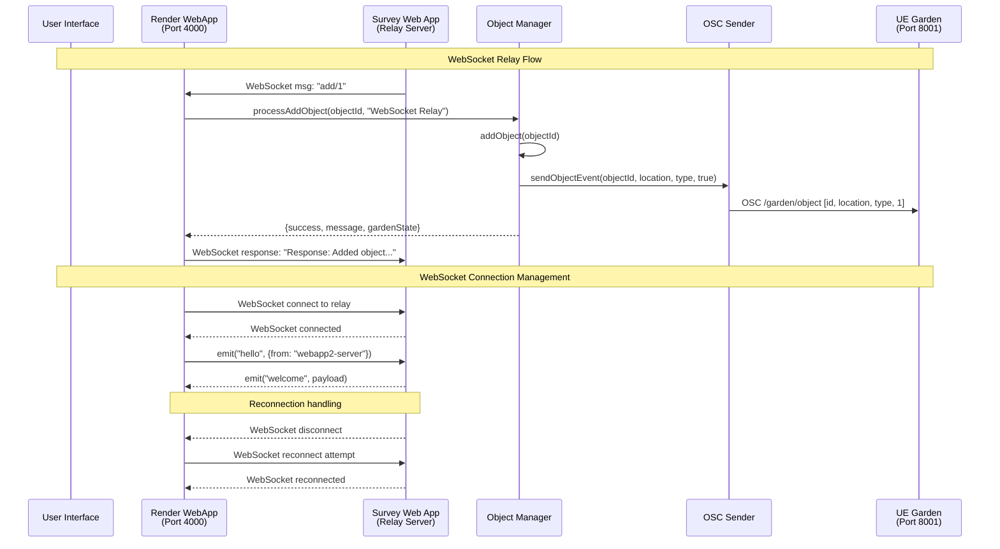

# Dali Dream Garden - Data Flow Diagram

## Swimlanes.io Format



## System Architecture Overview

### Components

1. **Render WebApp** (Port 4000)
   - Express.js server
   - WebSocket client to Survey Web App
   - Object management logic
   - OSC message sending
   - HTTP API endpoints

2. **Survey Web App** (Relay Server)
   - WebSocket relay server
   - Message broadcasting
   - Connection management

3. **Object Manager**
   - Garden state management
   - Object placement logic
   - Duplicate/overflow handling

4. **OSC Sender**
   - UE Garden communication
   - Object add/remove events

5. **UE Garden** (Port 8001) - Unreal Engine garden visualization

### Data Flow Patterns

#### WebSocket Relay Flow
```
Survey Web App → Render WebApp → Object Manager → OSC Sender → UE Garden
```

### Key Features

- **WebSocket Relay Communication**: Real-time message passing from Survey Web App
- **Real-time OSC Communication**: Immediate UE Garden updates
- **Connection Resilience**: Automatic WebSocket reconnection
- **Object Lifecycle**: Add, remove, duplicate, and displacement handling

### OSC Message Format

```
Address: /garden/object
Arguments:
  - objectId (integer)
  - locationId (string, e.g., "M1", "B3")
  - locationType (string, e.g., "M", "B", "RM")
  - isAdd (integer: 1=add, 0=remove)
```

### WebSocket Events

- `hello`: Initial handshake
- `welcome`: Server acknowledgment
- `msg`: Message broadcasting (including `/add/[number]` commands)
- Connection events: `connect`, `disconnect`, `reconnect`
